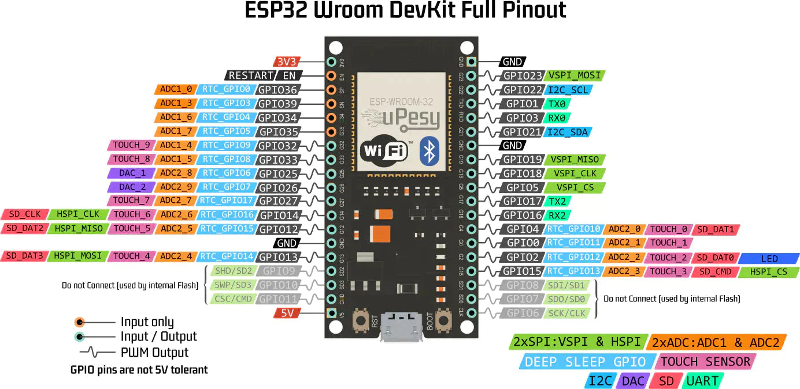

# ESP32 固件烧录器 (MicroPython)

一个用 **MicroPython** 编写的、运行在 ESP32 上的**自动固件烧录器**。

将本程序烧录到一台"主机 ESP32"，再连接另一台"目标 ESP32"，主机即可通过 GPIO 通断选择要刷的固件，自动完成擦除、写入、MD5 校验、复位运行。

> **v1.4.0 重大更新**：核心协议层复用 [micropython-lib](https://github.com/micropython/micropython-lib) 官方 `espflash.py`（MIT），自实现代码减少 49%。

## ✨ 特性

- ✅ **复用官方库**：SLIP / SYNC / Flash 读写 / MD5 / 复位 → 直接用 micropython-lib 的 `espflash.py`
- ✅ **Stub Loader 加速**：借鉴 esptool.py 实现 stub loader，烧录速度提升 4-8 倍
- ✅ **多芯片自动适配**：自动识别目标板型号（ESP32/S2/S3/C2/C3/C5/C6/H2/ESP8266），加载对应 stub binary
- ✅ **多固件支持**：内置 3 个最新 MicroPython 稳定版固件（v1.27/v1.28/v1.29）
- ✅ **GPIO 选择固件**：跳线 GPIO 到 3V3 即选定对应固件，无需修改代码
- ✅ **默认回退策略**：无 GPIO 选中时自动用最新版固件，**不接跳线即可直接烧录**
- ✅ **完整错误码体系**：15 个细分错误类，方便针对性处理
- ✅ **烧后版本验证**：烧完发 `version\n` 命令读回版本号验证（借鉴 Machiel80 FlashBox）
- ✅ **烧后日志监控**：可选持续读 UART 转发到 stdout（借鉴 helghast098 ESP32_flasher）
- ✅ **状态可视化**：板载 LED 不同频率闪烁反映 15 种工作状态
- ✅ **失败自动重试 + 持续运行模式**

## 🏗️ 架构：复用 vs 自实现

| 功能 | 来源 | 说明 |
|------|------|------|
| SLIP 编解码 | ✅ **micropython-lib/espflash.py** (MIT) | `_write_slip` / `_read_slip` |
| SYNC 握手 | ✅ **micropython-lib/espflash.py** | `bootloader()` |
| Flash 写入 | ✅ **micropython-lib/espflash.py** | `flash_write_file()` |
| MD5 校验 | ✅ **micropython-lib/espflash.py** | `flash_verify_file()` |
| 波特率切换 | ✅ **micropython-lib/espflash.py** | `set_baudrate()` |
| 进入下载模式 | ✅ **micropython-lib/espflash.py** | `bootloader()` 内含 EN/BOOT 时序 |
| Flash 大小检测 | ✅ **micropython-lib/espflash.py** | `flash_read_size()` |
| Stub Loader | 🔧 自实现 (借鉴 esptool.py) | `StubFlasher.load_stub()` |
| 芯片型号检测 | 🔧 自实现 (借鉴 esptool.py) | `StubFlasher.detect_chip()` |
| 错误码体系 | 🔧 自实现 (借鉴 esp-serial-flasher) | 15 个错误类 |
| GPIO 选固件 | 🔧 自实现 | `FirmwareSelector` |
| LED 状态机 | 🔧 自实现 | `LedStatus` (15 种状态) |
| 烧后版本验证 | 🔧 自实现 (借鉴 Machiel80) | `TargetVerifier` |
| 烧后日志监控 | 🔧 自实现 (借鉴 helghast098) | `TargetMonitor` |

## 📦 项目结构

```
esp32_firmware_flasher/
├── README.md                          # 本文件
├── .gitignore
├── main.py                            # 主程序入口 (440 行) — MicroPython 自动运行
├── config.py                          # 所有可配置参数 (351 行)
├── src/                               # 源码目录 (上传时复制到 ESP32 根目录)
│   ├── espflash.py                    # ✅ micropython-lib 官方库 (316 行, MIT)
│   ├── esptool_lite.py                # StubFlasher + 15 错误类 (498 行)
│   ├── led_state.py                   # LED 状态机 (15 种状态, 168 行)
│   ├── firmware_selector.py           # GPIO 选择固件 + 默认回退 (96 行)
│   ├── target_controller.py           # EN/BOOT 控制 + 目标板探测 (95 行)
│   ├── target_verifier.py             # 烧后版本验证 (借鉴 Machiel80, 181 行)
│   └── target_monitor.py              # 烧后日志监控 (借鉴 helghast098, 138 行)
├── tests/                             # 测试目录 (PC 上运行, 无需硬件)
│   ├── test_slip.py                   # SLIP 协议单元测试 (7 个)
│   ├── test_esptool_flow.py           # 架构测试 (4 个)
│   ├── test_errors.py                 # 错误码体系测试 (8 个)
│   ├── test_verifier.py               # 烧后验证测试 (9 个)
│   ├── test_stub_loader.py            # stub loader 测试 (7 个)
│   └── test_chip_detection.py         # 芯片检测测试 (14 个)
├── stub/                              # stub loader 目录 (10 种芯片, 66 KB)
│   ├── esp32_stub.json                #   ESP32 stub (3.6 KB)
│   ├── esp32s2_stub.json              #   ESP32-S2 stub (4.8 KB)
│   ├── esp32s3_stub.json              #   ESP32-S3 stub (6.2 KB)
│   ├── esp32c2_stub.json              #   ESP32-C2 stub (3.7 KB)
│   ├── esp32c3_stub.json              #   ESP32-C3 stub (4.1 KB)
│   ├── esp32c5_stub.json              #   ESP32-C5 stub (5.4 KB)
│   ├── esp32c6_stub.json              #   ESP32-C6 stub (4.1 KB)
│   ├── esp32h2_stub.json              #   ESP32-H2 stub (4.1 KB)
│   ├── esp32p4-rev1_stub.json         #   ESP32-P4 stub (5.9 KB)
│   └── esp8266_stub.json              #   ESP8266 stub (9.5 KB)
├── partitions/                        # 分区表
│   └── partitions_4mb.csv             #   4MB Flash 专用 (app 2MB + 文件系统 1.9MB)
├── docs/
│   └── esp32_pinout_upesy.jpg         # ESP32 完整引脚图
└── firmware/                          # 内置固件文件目录
    └── ESP32_GENERIC-20260824-v1.29.0.bin   # ~1.71 MB（最新稳定版）
```

## 📋 硬件需求

### 主机板 (Host)
- 1× ESP32 开发板，**≥ 4 MB Flash**（4MB 需自定义分区表，8MB+ 直接可用）

  **Flash 需求计算：**

  | 组成 | 大小 | 说明 |
  |------|------|------|
  | 主机 MicroPython 固件 (app 分区) | 1.71 MB | ESP32_GENERIC v1.29.0 |
  | 内置固件 v1.29.0 | 1.71 MB | 烧到目标板用 |
  | stub loader JSON (10 种芯片) | 65.6 KB | stub binary 数据 |
  | 源码文件 (9 个 .py) | 87.8 KB | 项目代码 |
  | **文件系统合计** | **1.86 MB** | 上传到 ESP32 |
  | **总 Flash 需求** | **3.56 MB** | app 2MB + 文件系统 1.8MB |

  | Flash 大小 | 是否够用 | 说明 |
  |------------|----------|------|
  | **4 MB** | **✅ 可以** | 需自定义分区表 (app 2MB + 文件系统 1.9MB)，见下方说明 |
  | 8 MB | ✅ 推荐 | 剩余 4.0 MB 空间，充裕且经济 |
  | 16 MB | ✅ 充裕 | 剩余 10.0 MB，适合未来扩展 |

  **4MB Flash 烧录方法（需自定义分区表）：**

  ```bash
  # 1. 下载 MicroPython 固件
  curl -L -o host_firmware.bin \
    https://micropython.org/resources/firmware/ESP32_GENERIC-20260824-v1.29.0.bin

  # 2. 生成 4MB 专用分区表二进制 (从 CSV)
  python3 -c "
  import sys; sys.path.insert(0, '.')
  # 用 esptool 的 gen_esp32part.py 转换
  " 2>/dev/null || \
  esptool.py --chip esp32 image_partition_table \
    partitions/partitions_4mb.csv partitions_4mb.bin

  # 3. 烧录分区表 + MicroPython 固件
  esptool.py --port /dev/ttyUSB0 --baud 460800 \
    write_flash 0x8000 partitions_4mb.bin \
    0x10000 host_firmware.bin
  ```

  分区表文件 `partitions/partitions_4mb.csv`：

  ```
  # Name,   Type, SubType,  Offset,   Size,    Flags
  nvs,      data, nvs,      0x9000,   0x4000,
  phy_init, data, phy,      0xf000,   0x1000,
  factory,  app,  factory,  0x10000,  0x200000,
  storage,  data, 0x01,     0x210000, 0x1F0000,
  ```

  > ✅ 4MB Flash 下仍保留全部 10 种芯片的 stub loader，支持多芯片自动适配。

- 已烧录最新 MicroPython 固件（建议 v1.29.0 或更高）
- 板载 LED（大多数 ESP32 开发板在 GPIO2）

### 目标板 (Target)
- 任意 ESP32 / ESP32-S2 / ESP32-S3 / ESP32-C2/C3/C5/C6 / ESP32-H2 / ESP8266 开发板
- 不需要预装任何固件

### 接线

| 主机引脚       | 方向 | 目标板引脚          | 说明                          |
|----------------|------|---------------------|-------------------------------|
| GPIO5          | →    | EN (RESET)          | 控制目标板复位，串 100Ω        |
| GPIO4          | →    | GPIO0 (BOOT)        | 控制进入下载模式               |
| GPIO18 (TX)    | →    | GPIO3 (UART0 RX)    | 串口数据发送                   |
| GPIO19 (RX)    | ←    | GPIO1 (UART0 TX)    | 串口数据接收                   |
| 3V3            | →    | 3V3                 | 供电                          |
| GND            | ↔    | GND                 | 共地（**必须**）               |

### 固件选择 GPIO（输入，下拉到 GND，跳线到 3V3 即选中）

| GPIO | 跳线到 3V3 后烧入固件                    |
|------|-------------------------------------------|
| 13   | `ESP32_GENERIC-20260824-v1.29.0.bin`     |
| 14   | `ESP32_GENERIC-20260406-v1.28.0.bin`      |
| 27   | `ESP32_GENERIC-20251209-v1.27.0.bin`      |
| 26   | （保留槽位，可在 `config.py` 配置）        |

> ⚠️ 同一时刻只允许一个 GPIO 被跳线到 3V3。不接任何跳线时自动用 v1.29.0 最新版。

## 🚀 快速开始

### 第 1 步：烧录主机 MicroPython 固件

```bash
pip install esptool
curl -L -o host_firmware.bin \
  https://micropython.org/resources/firmware/ESP32_GENERIC-20260824-v1.29.0.bin
esptool.py --port /dev/ttyUSB0 --baud 460800 write_flash 0x0 host_firmware.bin
```

### 第 2 步：上传项目文件

```bash
pip install mpremote
# main.py 和 config.py 在根目录 (MicroPython 自动运行)
mpremote connect /dev/ttyUSB0 cp main.py config.py :/
# src/ 下的模块也上传到 ESP32 根目录
mpremote connect /dev/ttyUSB0 cp src/espflash.py src/esptool_lite.py \
  src/led_state.py src/firmware_selector.py \
  src/target_controller.py src/target_verifier.py src/target_monitor.py :/
mpremote connect /dev/ttyUSB0 cp -r stub :/
mpremote connect /dev/ttyUSB0 cp -r firmware :/
```
```

### 第 3 步：接线 + 选择固件

- 按接线表连接主机和目标板，**确认 GND 共地**
- 不接任何固件选择跳线 → 自动用 v1.29.0 最新版
- 或跳线 GPIO13/14/27 到 3V3 选择对应固件版本

### 第 4 步：启动

给主机 ESP32 上电，启动后 ~1 秒自动进入检测循环。主机自动检测目标板 → 识别芯片型号 → 加载 stub → 烧录 → 校验 → 复位运行。

## 📟 ESP32 引脚图



## 🎨 LED 状态指示

| 状态                 | 频率 / 模式   | 含义                              |
|----------------------|---------------|-----------------------------------|
| `idle`               | 0.5 Hz 慢闪   | 空闲                              |
| `searching`          | 2 Hz 中速闪   | 正在探测目标板                    |
| `default_fallback`   | 1 Hz 中等慢闪 | 无 GPIO 选中，用默认固件          |
| `entering_boot`      | 5 Hz 快闪     | 进入下载模式 + SYNC（复用 ESPFlash） |
| `detecting_chip`     | 6 Hz 较快闪   | 芯片型号检测中                    |
| `loading_stub`       | 7 Hz 急速闪   | stub loader 加载中                |
| `erasing`            | 0.2 Hz 慢呼吸 | 整片擦除中                        |
| `flashing`           | 10 Hz 急速闪  | 正在写入固件数据                  |
| `verifying`          | 4 Hz 中快闪   | MD5 校验中                        |
| `post_verifying`     | 6 Hz 较快闪   | 烧后版本验证中（借鉴 Machiel80）  |
| `monitoring`         | 1.5 Hz 慢闪   | 烧后日志监控中（借鉴 helghast098）|
| `success`            | 常亮          | 烧录成功                          |
| `error`              | 常灭          | 烧录失败                          |
| `no_firmware_sel`    | 0.1 Hz 极慢闪 | 无固件选中且关闭默认回退          |

## ⚙️ 配置详解

所有参数集中在 `config.py`：

### 1. 硬件引脚
```python
PIN_TARGET_EN    = 5      # 主机 GPIO5  → 目标板 EN
PIN_TARGET_BOOT  = 4      # 主机 GPIO4  → 目标板 GPIO0
TARGET_UART_NUM  = 1      # UART1
PIN_UART_TX      = 18     # 主机 GPIO18 (TX)
PIN_UART_RX      = 19     # 主机 GPIO19 (RX)
FIRMWARE_SELECT_PINS = [13, 14, 27, 26]
```

### 2. Stub Loader + 多芯片适配
```python
STUB_LOADER_ENABLE  = True              # 启用 stub loader (4-8x 加速)
STUB_LOADER_DIR     = "/stub"           # stub binary 目录
STUB_WORK_BAUDRATE  = 460800            # stub 加载后工作波特率

CHIP_DETECT_MAGIC_REG = 0x40001000      # magic value 寄存器 (老芯片)
CHIP_MAGIC_VALUES = {                    # 老芯片 magic → 型号映射
    0x00F01D83: ("esp32",   "ESP32"),
    0xFFF0C101: ("esp8266", "ESP8266"),
    0x000007C6: ("esp32s2", "ESP32-S2"),
}
CHIP_ID_VALUES = {                       # 新芯片 chip_id → 型号映射
    9:  ("esp32s3", "ESP32-S3"),
    5:  ("esp32c3", "ESP32-C3"),
    13: ("esp32c6", "ESP32-C6"),
    # ... 共 7 种新芯片
}
```

### 3. 烧后验证（借鉴 Machiel80）
```python
POST_FLASH_VERIFY_ENABLE         = True
POST_FLASH_VERSION_CMD           = b"version\n"
POST_FLASH_EXPECTED_VERSION_PREFIX = b"VERSION:"
```

### 4. 烧后日志监控（借鉴 helghast098）
```python
POST_FLASH_MONITOR_ENABLE        = False  # 默认关闭
POST_FLASH_MONITOR_DURATION_SEC  = 30.0
```

## 🔧 工作原理

### 复用 espflash.py 的协议层

核心协议层（SLIP / SYNC / Flash 读写 / MD5）直接使用 micropython-lib 官方的 `espflash.py`：

```python
# espflash.py 提供的 ESPFlash 类:
tool = StubFlasher(reset_pin, gpio0_pin, uart)
tool.bootloader()           # 进入下载模式 + SYNC (复用 ESPFlash)
tool.flash_attach()         # 附加 SPI flash (复用 ESPFlash)
tool.flash_write_file(path) # 写固件 (复用 ESPFlash)
tool.flash_verify_file(path)# MD5 校验 (复用 ESPFlash)
tool.reboot()               # 复位 (复用 ESPFlash)
```

### 自实现的扩展层

在 ESPFlash 之上，`StubFlasher` 类扩展了：

```python
# StubFlasher 扩展:
chip_key, name = tool.detect_chip()        # 自动检测芯片型号 (借鉴 esptool.py)
tool.load_stub(chip_key=chip_key)          # 加载对应 stub (借鉴 esptool.py)
tool.set_baudrate(460800)                  # 切换高速 (复用 ESPFlash)
```

### 自动烧录流程

```
启动 → [读 GPIO 选固件] → [检测目标板] → [SYNC 握手]
  → [检测芯片型号] → [加载 stub] → [切换高速]
  → [flash_write_file] → [MD5 校验] → [复位目标板]
  → [烧后版本验证(可选)] → [日志监控(可选)]
  → [等待 5 秒] → 回到 [读 GPIO]
```

## 🧪 单元测试

6 套测试全部可在 PC（CPython）上运行：

```bash
cd esp32_firmware_flasher
for t in test_slip test_esptool_flow test_errors test_verifier test_stub_loader test_chip_detection; do
    echo "=== $t ==="
    python3 tests/$t.py 2>&1 | tail -3
    echo
done
```

| 测试 | 场景数 | 验证内容 |
|------|--------|----------|
| `test_slip.py` | 7 | SLIP 编解码 + 帧打包 + 校验和 |
| `test_esptool_flow.py` | 4 | StubFlasher 继承 ESPFlash + 方法存在性 |
| `test_errors.py` | 8 | 15 个错误类继承关系 + ERR_CODE 唯一性 |
| `test_verifier.py` | 9 | 烧后版本验证 8 种场景 |
| `test_stub_loader.py` | 7 | stub 加载流程 + OHAI + 文件不存在 |
| `test_chip_detection.py` | 14 | 10 种芯片检测 + 未知芯片 + 文件路径选择 |

## 📚 参考资料

### 官方文档
- [ESP32 ROM Bootloader Serial Protocol](https://docs.espressif.com/projects/esptool/en/latest/esp32/advanced-topics/serial-protocol.html)
- [MicroPython ESP32 文档](https://docs.micropython.org/en/latest/esp32/quickref.html)

### 复用 / 借鉴的开源项目
- [**micropython-lib/espflash**](https://github.com/micropython/micropython-lib/tree/master/micropython/espflash) — **核心协议层复用**（SLIP / SYNC / Flash 读写 / MD5），MIT
- [**espressif/esptool**](https://github.com/espressif/esptool) — stub loader 加载流程 + 芯片检测 + stub binary，Apache 2.0
- [**espressif/esp-serial-flasher**](https://github.com/espressif/esp-serial-flasher) — 错误码体系设计参考，Apache 2.0
- [**Machiel80/esp32-serial-flasher**](https://github.com/Machiel80/esp32-serial-flasher) — 烧后版本验证思路
- [**helghast098/ESP32_flasher**](https://github.com/helghast098/ESP32_flasher) — 烧后日志监控思路

## 📄 许可证

MIT License — Copyright (c) 2026 Z.ai

`espflash.py` 保留原始 MIT 许可证（Copyright (c) 2022 Ibrahim Abdelkader, MicroPython 项目）。
`stub/*.json` 来自 esptool 仓库，保留 Apache 2.0 许可证。
